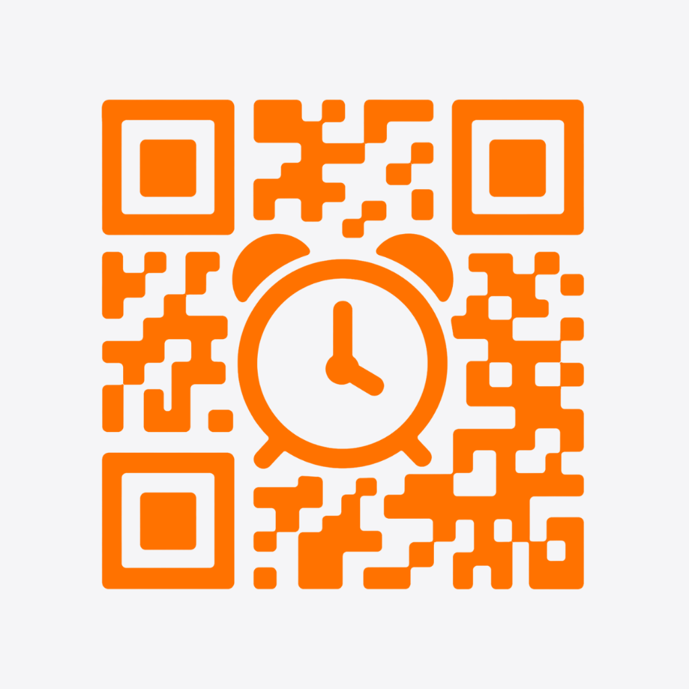
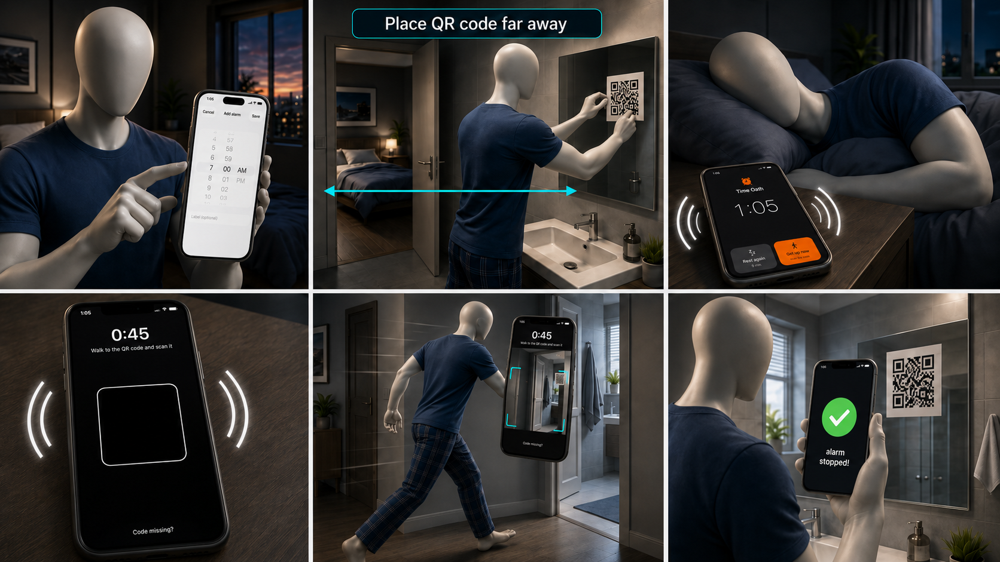
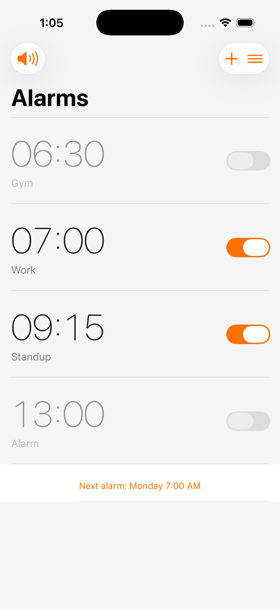
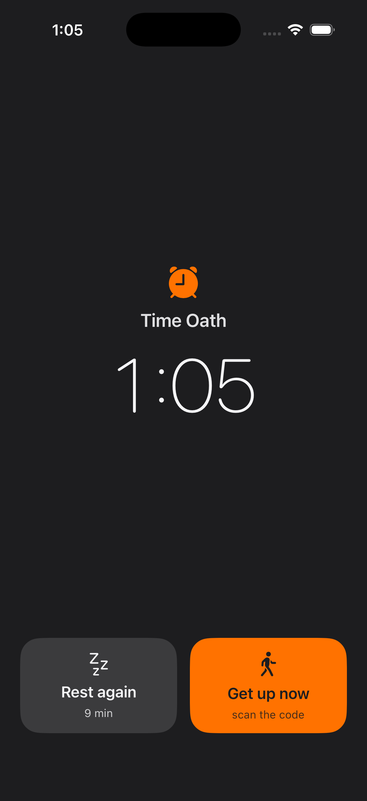
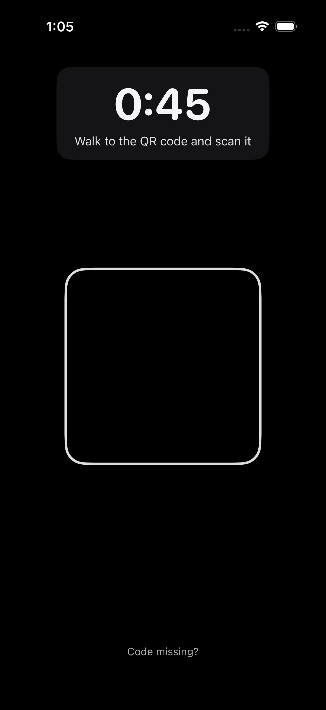
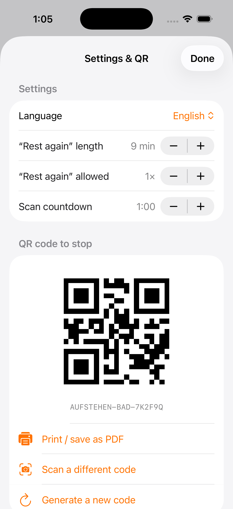

  
  <h1>Time Oath</h1>
  
<b>The alarm clock that makes you actually get out of bed.</b>

  
An iPhone alarm you can only switch off by getting up and scanning a QR code across the room.

## What it is

Time Oath is a simple iPhone alarm app with one rule: **the only way to stop the alarm is to scan a QR code you have printed and hung somewhere far from your bed** — like on the bathroom mirror. You have to physically get up and walk over to it. No endless snoozing, no cheating.

## Why it works

- **You can't stay in bed.** The alarm only stops when you scan the code across the room.
- **No escape inside the app.** The moment it rings, the app locks itself — you can't disable, delete, or change the alarm to get around it. Only scanning stops it.
- **It really wakes you.** Rings at full volume even in Do Not Disturb, on silent, and while the phone is locked.
- **One short rest, then up.** An optional "Rest again" gives you a few more minutes once. After that, you have to get up.
- **Yours alone.** Fully offline. No account, no internet, no tracking, no ads.
- **Backup code.** If your printed QR ever gets damaged, a long emergency code can stop the alarm.

## Screenshots

  
  
  
  

## How it works

1. **Set an alarm** in the app.
2. **Print the QR code** (in the [`Printable`](Printable) folder) and hang it far from your bed.
3. In the morning it **rings loudly**.
4. **Walk over and scan** the code to turn it off. Good morning.

## Install it on your iPhone (from a Mac)

You do not need to be a developer. You build the app once, for free, with Apple's own tools.

### Easiest way — let an AI assistant do it

1. Install **Xcode** (free, from the Mac App Store) and plug your iPhone into the Mac.
2. Open an AI coding assistant on your Mac (for example Claude Code or Cursor).
3. Send it this:
   > *Clone https://github.com/Nayrak2701/Time-Oath, then build and install the app on my connected iPhone using my Apple ID.*
4. Approve the Apple ID sign-in when asked, and on the iPhone tap **Trust** for the developer.

That's it — the assistant does the rest.

### Manual way — step by step

> **What you need (all free):** a Mac, **Xcode**, and an **Apple ID**. A USB-C cable for the first install.

1. Click the green **Code** button at the top of this page → **Download ZIP**, then unzip it (or `git clone` it).
2. Open **`Aufstehen.xcodeproj`** in Xcode.
3. Plug in your iPhone and unlock it.
4. At the top of Xcode, select your iPhone. Open the **Signing & Capabilities** tab and pick your Apple ID under **Team** (add your Apple ID if it isn't listed).
5. Press the **▶ Run** button. On the first run, on your iPhone open **Settings → General → VPN & Device Management** and **trust** your developer profile, then open the app.
6. **Print** the QR code from the [`Printable`](Printable) folder and hang it across the room.

### Keeping it installed

With a free Apple ID the app runs for **7 days**, then you just press **▶ Run** in Xcode again to renew it. A paid Apple Developer account ($99/year) makes each build last a full year.

Don't want to remember that every week? The [`keep-alive`](keep-alive) folder has an optional one-time setup that renews the app for you automatically in the background, forever.

## Privacy

100% offline. No account, no servers, no analytics, no ads. Nothing ever leaves your phone.

## License

[MIT](LICENSE) — free to use, change, and share.
